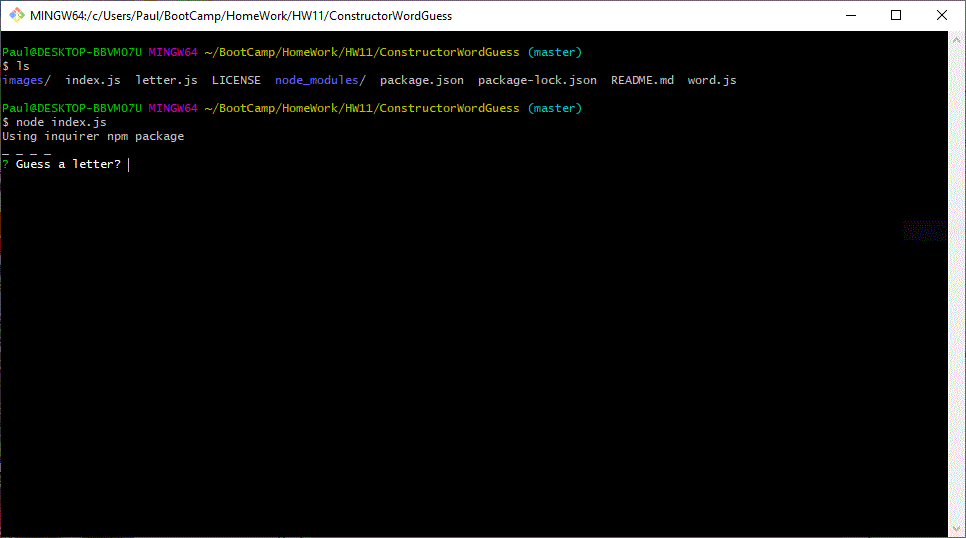

# Advanced JavaScript Assignment: Constructor Word Guess

### Overview

Create a Word Guess command-line game using constructor functions.

### GitHub Access

- [Source code repository](<https://github.com/pvraab/ConstructorWordGuess>)

  This is a Node.js application so if you want to run it you must:

  - git clone it to your local machine
  - cd working directory - use git bash shell
  - npm install - to install all of the Node.js required packages as described in package.json
  - node index.js - this will run the app

### Detailed Functionality

The completed game meets the following criteria:

1. The completed game is able to receive user input using the `inquirer` and `prompt` npm packages. There is a roll of the random number dice at the start of each game to determine which is used.
2. Three JavaScript files are used to manage the game:

- **Letter.js**: Contains a constructor, Letter. This constructor provides functions to either display an underlying character or a blank placeholder (an underscore), depending on whether or not the user has guessed the letter. The means the constructor defines:
  - A string value to store the underlying character for the letter
  - A boolean value that stores whether that letter has been guessed yet
  - A function that returns the underlying character if the letter has been guessed, or a placeholder (an underscore) if the letter has not been guessed
  - A function that takes a character as an argument and checks it against the underlying character, updating the stored boolean value to true if it was guessed correctly
- **Word.js**: Contains a constructor, Word that depends on the Letter constructor. This is used to create an object representing the current word the user is attempting to guess. The constructor defines:
  - An array of `new` Letter objects representing the letters of the underlying word
  - A function that returns a string representing the word. This function displays the characters guessed or an underscore.
  - A function that takes a character as an argument and calls the guess function on each letter object (the second function defined in `Letter.js`)
- **index.js**: The file containing the logic for the course of the game, which depends on `Word.js` and:
  - Randomly selects a word and uses the `Word` constructor to store it. This function is actually in word.js and uses the random-word npm package.
  - Prompts the user for each guess and keeps track of the user's remaining guesses
  - Determines when the game is won or lost

3. `Letter.js` *does not* `require` any other files.

4. `Word.js` *only* requires `Letter.js`

5. The Letter constructor defines the letter's display function  as toString`, JavaScript will call that function automatically whenever casting that object to a string (check out this example: <https://jsbin.com/facawetume/edit?js,console>)

6. We are converting everything to lower case and using the charCodeAt() function to make sure we have a valid letter in the ASCII character range 97-122:

   

   ​        letter = letter.toLowerCase()

   ​        // Check for a valid letter - not a number or some other keypress

   ​        // Use ASCII character range from 97-122

   ​        console.log(letter.charCodeAt());

   ​        if (letter.charCodeAt() < 97 || letter.charCodeAt() > 122) {

   ​            console.log("Not a valid letter!\n");

   ​            return;

   ​        }

   

### Challenges

This was a pretty straightforward application to develop.

### Results

Gameplay is as follows:

- The user runs the index.js script using node

$ node index.js

- A random word is selected from the "random-word" npmjs package each time the game is played.
- The app randomly selects either the inquirer or prompts package to do the queries and displays which one is used.

Using inquirer npm package

- A word pattern is displayed using underscores ("_") to represent the unguessed letters in the word. The user is prompted to guess a letter after which the letter is entered. The ASCII code of the keystroke is displayed. 

 _ _ _ _

? Guess a letter? a
97

- A result is then displayed. Either a match, a wrong guess, a duplicate entry, or an invalid non-letter key entry. If it is a match, the number of matches is displayed and the letters are filled in on the word pattern. If not a match, then the number of guesses left is displayed.

###### Match

Number of matches 1
Match!!!

_ _ o m a _ _

###### Wrong Guess

Number of matches 0
Wrong Guess!!!  4 guesses remaining

###### Duplicate

Letter has already been guessed!

###### Invalid non-letter key entry

Not a valid letter!

A winning game is shown [here](./images/image01.gif), [here](./images/image02.gif), and [here](./images/image03.gif).

A losing game is shown [here](./images/image04.gif), [here](./images/image05.gif), and [here](./images/image06.gif).

### Technologies Used

- JavaScript
- Node.js
- npm package random-word to generate a new word each time the app is run
- npm package colors to do some intersting color displays
- npm packages inquirer and prompts to ask questions - I am trying out both
- Good Quality Coding Standards used
- Deployed on GitHub

------

- Added To My Portfolio at:

  [My Portfolio](<https://github.com/pvraab/RaabPortfolio>)

  

------

